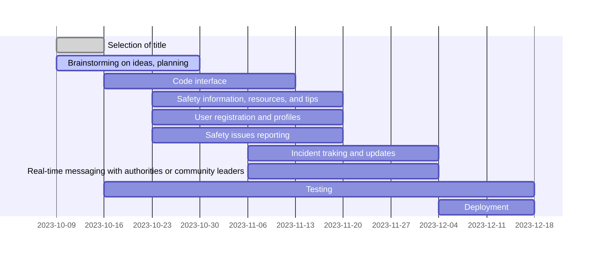

# iSafety

## Group members:

* [Song Kim Hian](https://github.com/song1351) (BCS21090023)
* [Howard Yam How Wei](https://github.com/howardyam) (BCS21090002)
* [Nicholas Yii Teck Yaen](https://github.com/BCS21090011) (BCS21090011)

---

## Description:

This is project for course Mobile Application Development (CSS3344).

---

## Requirements:

### **Comunity Safety Reporting App (SDG 16)**

* **Inspired by:**

  The goal to promote safety and community well-being, this app provides a platform for citizens to report safety concerns, incidents, and issues in their community.

* **Essential Features:**
  * User registration and profiles for community members.
  * Safety issue reporting with descriptions, images, and location tagging.
  * Incident tracking and updates on reported issues.
  * Real-time messaging with authorities or community leaders.
  * Anonymous reporting for sensitive concerns.
  * Safety information resources and tips.

* **Optional But Nice to Have:**
  * Notification system for status updates on reported issues.
  * Social sharing of safety tips and incident awareness.
  * Integration with emergency services and local authorities.
  * A community bulletin board for announcements and events.

---

## Difficulty:
  * UI/UX: ★★☆☆☆
  * Data binding: ★★★★☆

---

## Gantt Chart:

---

## Links:

* [Github](https://github.com/howardyam/ISafety)
* [Figma](https://www.figma.com/file/v3m7UtkiCCXybX9UQXmI85/Untitled?type=design&node-id=0%3A1&mode=design&t=BurujBsPZJSpXafC-1)
